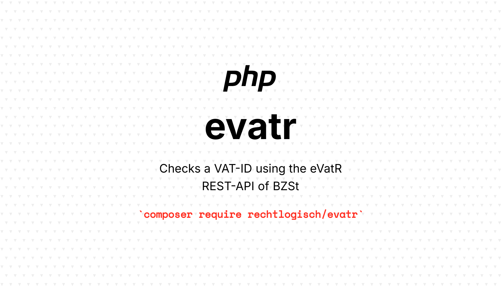

[](https://packagist.org/packages/rechtlogisch/evatr)
[](https://github.com/rechtlogisch/evatr/actions/workflows/run-tests.yml)
[](https://codecov.io/github/rechtlogisch/evatr-php)
[](https://packagist.org/packages/rechtlogisch/evatr)

# evatr

> Checks a VAT-ID using the eVatR REST-API of the German Federal Central Tax Office (Bundeszentralamt für Steuern, BZSt)

> [!CAUTION]
> This package is in early development and is not yet ready for production use. It is currently being tested and may undergo significant changes.

> [!IMPORTANT]
> This is an unofficial wrapper for the eVatR API. For official documentation and terms of use, please refer to the [German Federal Central Tax Office (BZSt)](https://www.bzst.de/DE/Unternehmen/Identifikationsnummern/Umsatzsteuer-Identifikationsnummer/umsatzsteuer-identifikationsnummer_node.html) website.

> [!NOTE]
> This package uses the new REST-API released in July 2025. The old XML-RPC API is being discontinued and will be sunset on **November 30th, 2025** (based on information from BZSt-Newsletter USTKV 01/2025 dated July 1st, 2025).

## Installation

You can install the package via composer:

```bash
composer require rechtlogisch/evatr
```

## Quick Start

### Simple Validation

Validates only the VAT-ID without company data verification:

```php
use Rechtlogisch\Evatr\Evatr;

$result = (new Evatr(
  vatIdOwn: 'DE123456789',     // Your German VAT-ID (required)
  vatIdForeign: 'ATU12345678', // VAT-ID to validate (required)
))->check();
```

or alternatively use the helper function:

```php
$result = checkVatId(vatIdOwn: 'DE123456789', vatIdForeign: 'ATU12345678');
```

### Qualified Validation

Validates VAT-ID and verifies company data:

```php
use Rechtlogisch\Evatr\Evatr;

$result = (new Evatr(
  vatIdOwn: 'DE123456789',     // Your German VAT-ID (required)
  vatIdForeign: 'ATU12345678', // VAT-ID to validate (required)
  company: 'Test GmbH',        // Company name (required for qualified validation)
  location: 'Wien',            // City (required for qualified validation)
  street: 'Musterstr. 1',      // Street address (optional)
  zip: '1010',                 // Postal code (optional)
))->check();
```

or alternatively use the helper function:

```php
$result = confirmVatId(
  vatIdOwn: 'DE123456789',
  vatIdForeign: 'ATU12345678',
  company: 'Test GmbH',
  street: 'Musterstr. 1',
  zip: '1010',
  location: 'Wien',
);
```

### Including Raw Response

```php
$result = (new Evatr(
  vatIdOwn: 'DE123456789',
  vatIdForeign: 'ATU12345678'
))->includeRaw()->check();
```

or with helper functions

```php
$result = checkVatId(
  vatIdOwn: 'DE123456789',
  vatIdForeign: 'ATU12345678',
  includeRaw: true
);
```

## API Reference

### Constructor

```php
$evatr = new Evatr(
  vatIdOwn: string,      // Your German VAT-ID (required)
  vatIdForeign: string,  // VAT-ID to validate (required)
  company: ?string,      // Company name (optional, required for qualified validation)
  location: ?string,     // City (optional, required for qualified validation)
  street: ?string,       // Street address (optional)
  zip: ?string,          // Postal code (optional)
);
```

or alternatively using RequestDto:

```php
$request = new RequestDto(
  vatIdOwn: 'DE123456789',
  vatIdForeign: 'ATU12345678',
  // ... other parameters
);
$evatr = new Evatr($request);
```

### Methods

#### check(): ResultDto

Performs the VAT-ID validation:

```php
$result = $evatr->check();
```

#### includeRaw(bool $value = true): self

Includes the raw API response in the result:

```php
$evatr->includeRaw(true)->check();
```

### Response Object (ResultDto)

The `check()` method returns a `ResultDto` object with the following methods:

```php
$result->getVatIdOwn(): string;         // Own VAT-ID which was used for the request
$result->getVatIdForeign(): string;     // Foreign VAT-ID which was validated
$result->getHttpStatusCode(): ?int;     // HTTP status code
$result->getTimestamp(): ?string;       // Query timestamp (ISO-8601 string)
$result->getStatus(): ?Status;          // Status enum
$result->getMessage(): ?Status;         // Status enum (alias to `getStatus()`)
$result->getDateFrom(): ?string;        // Valid from date
$result->getDateTill(): ?string;        // Valid until date
$result->getCompany(): ?QualifiedResult;   // Company validation result
$result->getStreet(): ?QualifiedResult;    // Street validation result
$result->getZip(): ?QualifiedResult;       // ZIP validation result
$result->getLocation(): ?QualifiedResult;  // Location validation result
$result->getRaw(): ?string;             // Raw API response (if requested)
$result->toArray(): array;              // Convert to array
```

### Status Codes

The API returns various status codes via the `Status` enum. All status codes are available as enum cases:

```php
use Rechtlogisch\Evatr\Enum\Status;

// Check the status
if ($result->getStatus() === Status::EVATR_0000) {
  // VAT-ID is valid
}

// Get human-readable description
$description = $result->getStatus()->description();
```

### Validation Results (Qualified Validation)

For qualified validation, the response includes validation results for each field via the `QualifiedResult` enum:

- **A** - Data matches registered information
- **B** - Data does not match registered information  
- **C** - Data was not requested
- **D** - Data not provided by the EU member state

```php
use Rechtlogisch\Evatr\Enum\QualifiedResult;

if ($result->getCompany() === QualifiedResult::A) {
  // Company name matches
}
```

### Helper Functions

The package provides convenient helper functions:

#### checkVatId()

```php
function checkVatId(
    string $vatIdOwn,
    string $vatIdForeign,
    bool $includeRaw = false
): ResultDto;
```

#### confirmVatId()

```php
function confirmVatId(
  string $vatIdOwn,
  string $vatIdForeign,
  ?string $company,
  ?string $street,
  ?string $zip,
  ?string $location,
  bool $includeRaw = false
): ResultDto;
```

### Field Mapping

The API uses German terms, which have been mapped to parameters:

#### Request

| BZSt API          | evatr          |
|-------------------|----------------|
| anfragendeUstid   | vatIdOwn       |
| angefragteUstid   | vatIdForeign   |
| firmenname        | company        |
| ort               | location       |
| strasse           | street         |
| plz               | zip            |

#### Response

| BZSt API          | evatr          |
|-------------------|----------------|
| anfrageZeitpunkt  | timestamp      |
| gueltigAb         | dateFrom       |
| gueltigBis        | dateTill       |
| ergFirmenname     | company        |
| ergStrasse        | street         |
| ergPlz            | zip            |
| ergOrt            | location       |

### Language of status messages (EVATR_LANG)

By default, status messages (human-readable descriptions of evatr-* codes) are returned in German. To switch to English messages, set the following environment variable:

```bash
# .env
EVATR_LANG=en
```

Supported values:
- de (default): German messages
- en: English messages

This affects:
- Status::description()
- ResultDto->toArray()['message']

### Additional endpoints and helpers

The client exposes supplementary endpoints of the eVatR API.

#### Status messages

```php
$messages = Evatr::getStatusMessages(); // array of DTO\StatusMessage
```

Each StatusMessage item has the shape:

```php
use Rechtlogisch\Evatr\DTO\StatusMessage;

$statusMessage = new StatusMessage(
  status: 'evatr-0000',
  category: 'Result', // category is always English and language-invariant: Result | Error | Hint
  http: 200,
  field: null, 
  message: 'Die angefragte Ust-IdNr. ist zum Anfragezeitpunkt gültig.'
);
```

#### EU member states availability

```php
$states = Evatr::checkAvailability(); // array<string,bool> map of code => available
// Example: [ 'DE' => true, 'AT' => false, ... ]

// Only not available:
$notAvailable = Evatr::checkAvailability(onlyNotAvailable: true); // [ 'AT' => false, ... ]
```

## Error Handling

The library handles various error scenarios:

```php
try {
    $result = checkVatId('DE123456789', 'INVALID');
    
    // Check for specific error statuses
    if ($result->getStatus() === Status::EVATR_0005) {
        echo 'Invalid VAT-ID format: ' . $result->getStatus()->description();
    }
} catch (JsonException $e) {
    // Handle JSON parsing errors
    echo 'Invalid API response: ' . $e->getMessage();
} catch (RuntimeException $e) {
    // Handle other runtime errors
    echo 'Error: ' . $e->getMessage();
}
```

## Testing

### Running Tests

```bash
composer test
```

### Test Data

The library includes test VAT-IDs that can be used for development and testing:

```php
// Simple validation test
$testRequest = [
  'vatIdOwn' => 'DE123456789',
  'vatIdForeign' => 'ATU12345678',
];

// Qualified validation test
$qualifiedTestRequest = [
  'vatIdOwn' => 'DE123456789',
  'vatIdForeign' => 'ATU12345678',
  'company' => 'Musterhaus GmbH & Co KG',
  'street' => 'Musterstrasse 22',
  'zip' => '12345',
  'location' => 'musterort',
];
```

### Environment Variables

For testing with real VAT-IDs, you can set environment variables:

```bash
# .env
VATID_OWN=DE123456789
VATID_FOREIGN=ATU12345678
```

## Rate Limits and Best Practices

- The API has rate limits. Implement appropriate delays between requests
- Cache results when possible to reduce API calls
- Handle all possible status codes in your application
- Always validate VAT-ID formats before making API calls

## Changelog

Please see [CHANGELOG](CHANGELOG.md) for more information on what has changed recently.

## Contributing

Please see [CONTRIBUTING](https://github.com/spatie/.github/blob/main/CONTRIBUTING.md) for details.

## Security Vulnerabilities

If you discover any security-related issues, please email [open-source@rechtlogisch.de](mailto:open-source@rechtlogisch.de) instead of using the issue tracker.

## Credits

- [Krzysztof Tomasz Zembrowski](https://github.com/zembrowski)
- [All Contributors](../../contributors)

## License

The MIT License (MIT). Please see [License File](LICENSE.md) for more information.
